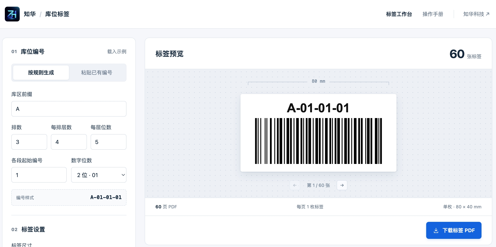
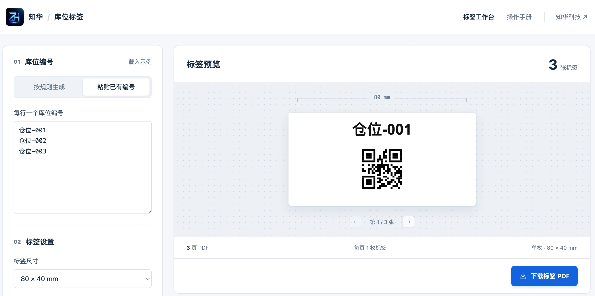

# 知华库位标签


由 [知华科技（上海如静知华信息科技有限公司）](https://www.zhuatech.cn/) 提供的免费仓库库位标签工具。支持按「库区—排—层—位」批量编号、粘贴已有编号、生成条形码或二维码，以及按实际标签尺寸导出 PDF。

## 页面实录



按规则批量生成库位编号，预览条形码标签，并导出实际尺寸 PDF。



粘贴已有编号，使用二维码保留中文内容。

## 主要功能

| 功能     | 支持的操作                                       |
| -------- | ------------------------------------------------ |
| 库位编号 | 按库区、排、层、位批量生成；也可逐行粘贴已有编号 |
| 标签预览 | 选择 Code 128 条形码或二维码，逐张检查编号       |
| PDF 导出 | 自定义标签尺寸；单枚标签纸或 A4 拼版             |
| 配置保存 | 在当前浏览器保存设置，导入或导出配置文件         |

使用方法见站内「操作手册」或 [操作手册](docs/操作手册.md)。

## 运行

Node.js 24 LTS，npm 11。依赖锁定在 `package-lock.json`。

```sh
npm ci
npm run build
npm run dev
```

打开 `http://127.0.0.1:4178/`。修改 `src/` 后重新构建并刷新。`dist/` 是可部署到静态托管的完整网站，所有运行依赖均随站点提供，不依赖第三方 CDN。

## 验证

```sh
npm run format:check
npm run lint
npm test
npm run build
```

测试覆盖编号边界、重复与非法字符、配置恢复、实际尺寸和分页，以及使用独立 ZXing 解码器检查条形码与二维码内容。测试 PDF 写入忽略的 `test-results/`。

## 使用范围

- 每次最多 1000 张；4 种预设尺寸与自定义宽高（10–200 mm）。默认标签打印机模式：每页一枚，PDF 页面与标签尺寸一致；A4 拼版为备选。
- 通过 PDF 阅读器和厂商驱动打印，驱动的纸张尺寸、方向与实际标签纸保持一致。
- Code 128 支持可打印 ASCII；中文等内容请使用 QR。不可见控制字符与重复编号阻止导出，可明确操作去重。
- 条码与 QR 以矢量矩形写入 PDF。ASCII 编号为文本；非 ASCII 编号使用当前设备字体以 600 DPI 绘制，避免 PDF 中文缺字。不同系统的字形可能不同。
- 自动检查编码密度和文字尺寸。打印时选择「实际大小」或「100%」。
- A4 为手工裁切拼版，预切标签纸需使用对应版式。
- 扫码只得到编号，没有库存查询或出入库后台。
- 设置和编号存储在当前浏览器 `localStorage`，用户可以导出配置；清除浏览器数据会删除本地记录。没有统计追踪、文件上传或远程保存。

## 文件

- `src/core.js`：配置、编号规则、校验、毫米排版。
- `src/encoding.js`：统一的条码几何，用于预览和输出。
- `src/pdf.js`：实际尺寸 PDF 导出。
- `src/app.js`：交互、本地保存和渐进式 WebMCP 支持。
- `src/assets/zhuatech-logo.jpg`：知华科技 LOGO。
- `docs/操作手册.md`：编号、标签尺寸、配置备份和打印操作说明。
- `docs/images/location-*.jpeg`：标签工作台实录。

## 源码与授权

© 2026 上海如静知华信息科技有限公司，保留所有权利。网页工具免费使用；源码商业授权、二次开发与客户交付请联系知华科技。第三方依赖遵循各自许可证，许可文本随构建复制到 `dist/vendor/THIRD_PARTY_NOTICES.txt`。

## 联系知华科技

上海如静知华信息科技有限公司。企业 AI 定制、仓储系统开发、WMS / ERP 对接、部署及商业授权咨询：

- 官网：[www.zhuatech.cn](https://www.zhuatech.cn/)
- 微信：`zhuatech` / `zhuatech2`

|                             微信 zhuatech                             |                             微信 zhuatech2                             |
| :-------------------------------------------------------------------: | :--------------------------------------------------------------------: |
|  |  |
